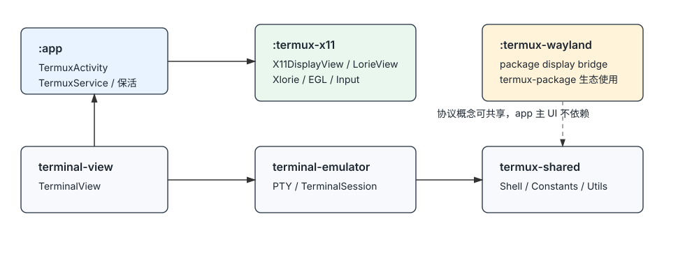
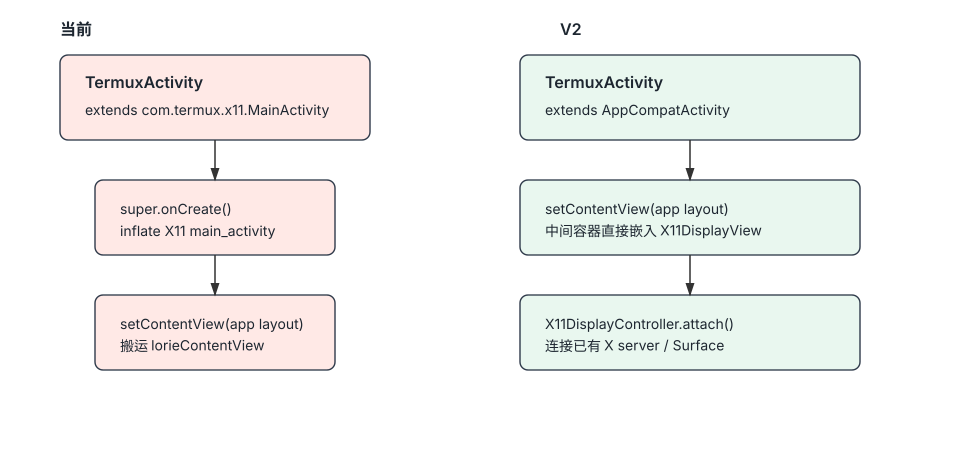
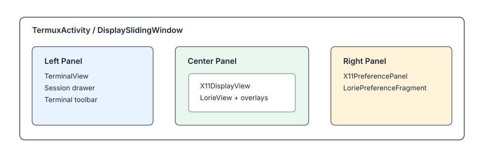
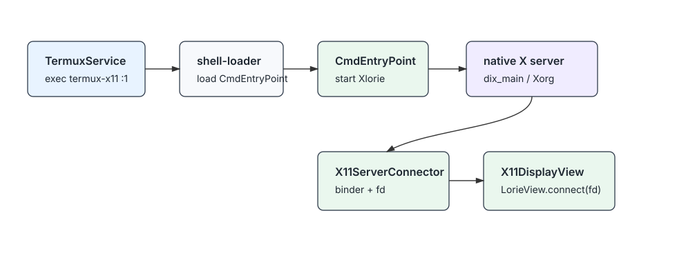
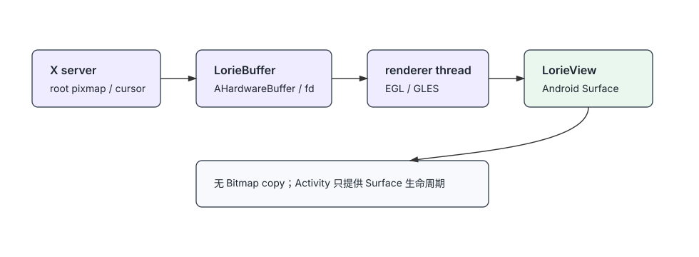
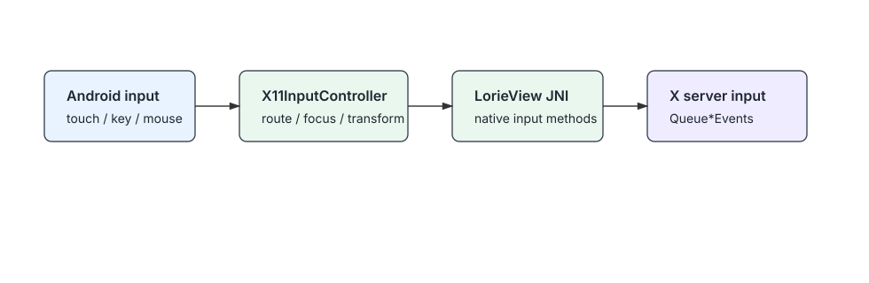
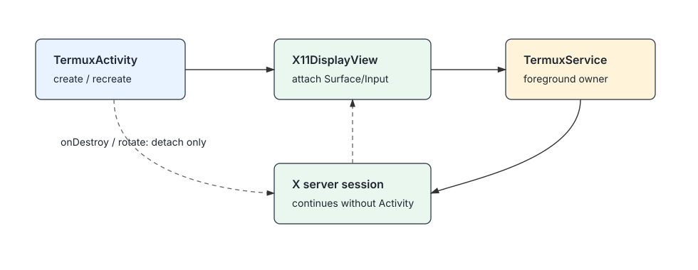
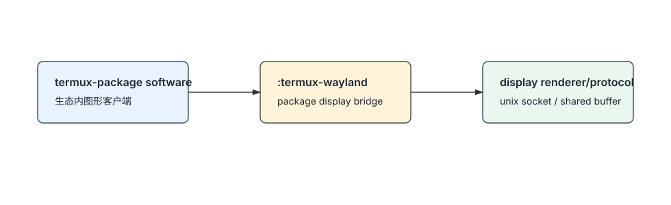
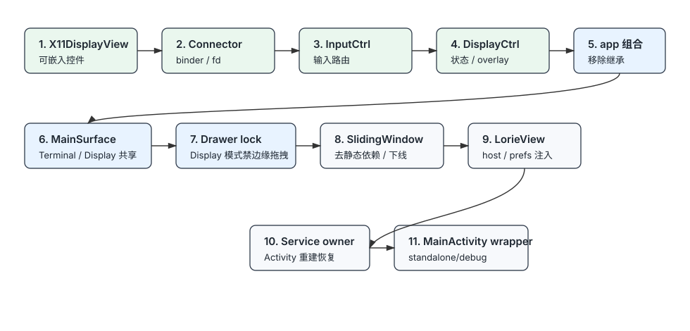

# Archecture V2

## 1. 修正后的模块边界

当前工程的干净运行时边界应按实际目录和职责理解：

| 模块 | 运行时角色 | 说明 |
| --- | --- | --- |
| `:app` | 主 Android App | `TermuxActivity`、`TermuxService`、终端 UI、桌面容器、保活、脚本入口。 |
| `:termux-x11` | App 内嵌 X11 显示实现 | `LorieView`、native Xlorie、EGL 渲染、输入桥接、X11 preference/controller。 |
| `:terminal-view` | 终端 View | `TerminalView` 自定义 View，Canvas 渲染终端内容。 |
| `:terminal-emulator` | 终端核心 | PTY、fork/exec、VT/xterm escape、screen buffer。 |
| `:termux-shared` | 公共层 | 常量、shell、properties、通知、local socket、命令模型。 |
| `:float-ball` | 辅助 UI | 应用内或 overlay 悬浮球菜单。 |
| `:termux-wayland` | termux-package 生态显示桥 | 服务于生态软件显示桥接；不参与 `:app` 主 UI 运行时。 |
| `:shell-loader` | X11 命令入口加载器 | 从 shell 侧加载 `CmdEntryPoint`，启动 native X server。 |



## 2. V2 目标

1. `TermuxActivity` 与 `termux-x11.MainActivity` 从继承改为组合。
2. `termux-x11` 对 `:app` 暴露可嵌入 UI 控件，而不是 Activity 基类。
3. X11 显示器、终端、X11 设置面板保持在同一个 `TermuxActivity`。
4. X11 server 生命周期归 `TermuxService` 托管，Activity 只 attach/detach 显示面。
5. 保留 `SurfaceView + EGL/GLES + AHardwareBuffer/fd` 渲染链路，避免 Bitmap copy。
6. `termux-wayland` 继续作为生态软件显示桥，不纳入 `:app` 主运行时架构。

## 3. 当前主要耦合点

当前强耦合来自：

```java
public class TermuxActivity extends com.termux.x11.MainActivity implements ServiceConnection
```

直接后果：

- `TermuxActivity.onCreate()` 依赖 `super.onCreate()` 先 inflate `termux-x11` 的 `main_activity.xml`。
- `TermuxActivity` 再 `setContentView(R.layout.activity_termux_main)`，然后把 `lorieContentView` 搬进中间面板。
- `DisplaySlidingWindow` 依赖 `MainActivity.mLorieViewConnected`。
- `LorieView` 多处依赖 `MainActivity.getInstance()` / `MainActivity.getPrefs()`。
- X11 输入、preference、WinHandler、Activity window flags 混在 `MainActivity` 生命周期里。

这些耦合使主 Activity 与 X11 Activity 生命周期不可分离，也增加了后台、旋转、重建时的状态风险。

## 4. 目标结构

可嵌入显示框架放在 `:termux-x11` 内部完成。

建议拆分：

| 类/组件 | 所属模块 | 职责 |
| --- | --- | --- |
| `X11DisplayView extends FrameLayout` | `:termux-x11` | App 可直接嵌入的 X11 显示控件，内部持有 `LorieView` 和 overlay。 |
| `X11DisplayController` | `:termux-x11` | attach/detach、connect/reconnect、surface 状态、显示状态。 |
| `X11DisplayHost` | `:termux-x11` | 由 `TermuxActivity` 实现，向显示层提供 Activity 能力和 app 集成回调。 |
| `X11ServerConnector` | `:termux-x11` | 处理 `CmdEntryPoint.ACTION_START`、binder、fd、logcat fd。 |
| `X11InputController` | `:termux-x11` | touch/key/mouse/stylus/gamepad 到 X server 的输入桥。 |
| `X11PreferencePanel` | `:termux-x11` | 封装当前 `LoriePreferenceFragment`，提供 app 内嵌设置页。 |
| `MainActivity` | `:termux-x11` | 降级为 standalone/debug wrapper，不再作为 `:app` 基类。 |

`TermuxActivity` 目标继承关系：

```java
public class TermuxActivity extends AppCompatActivity implements ServiceConnection
```

集成约束：

- `X11DisplayView` 不直接持有 `TermuxActivity`。
- Activity 能力通过 `X11DisplayHost` 注入，例如 `getActivity()`、`getFragmentManager()`、`openPreference()`、`requestX11Focus()`。
- Activity 生命周期通过 `X11DisplayController.attach(host, view)` / `detach()` 传入。
- `LorieView` 内部只允许短期从 `Context` 查找 Activity，用于 IME、window token、`runOnUiThread()` 等场景；不得保存 Activity 强引用。
- `TermuxActivity implements X11DisplayHost`，只负责 app 集成，不进入 X11 内部状态机。



## 5. 同 Activity UI 结构

`TermuxActivity` 保持三面板结构，但中间面板不再搬运 `MainActivity` 的 root view。

目标 UI：

| 区域 | 内容 |
| --- | --- |
| 左侧 | 终端、session list、toolbar。 |
| 中间 | `X11DisplayView`，内部包含 `LorieView`、not connected stub、输入 overlay、X11 EK bar。 |
| 右侧 | `X11PreferencePanel`。 |



## 6. 主内容区共享方案

另一种更贴近现有布局的方案，是复用 `activity_termux.xml` 里的现有 `DrawerLayout`，把主内容区从单一 `TerminalView` 改成共享容器。

目标结构：

```text
DrawerLayout
  content:
    MainSurfaceContainer(FrameLayout)
      TerminalView
      X11DisplayView
  start drawer:
    session list
    terminal/display switch control
    existing terminal actions
```

不建议用 Fragment 切换 `TerminalView` 和 `X11DisplayView`。这不是导航页，而是两个强状态显示面；`FrameLayout + visibility/controller` 更直接，也能减少 `SurfaceView` 被 fragment transaction 反复销毁重建。

切换规则：

- Terminal mode：`TerminalView` 可见，`X11DisplayView` 隐藏，drawer 边缘手势可按现状启用。
- Display mode：`X11DisplayView` 可见，`TerminalView` 隐藏或降级后台，X11 获得焦点和输入。
- 新 display connection 到达时，`X11ServerConnector.onConnected()` 触发 `MainSurfaceController.showDisplay()`。
- start drawer 内新增明确控件控制 `TerminalView` / `X11DisplayView` 显示状态。

## 7. Drawer 手势策略

普通 `DrawerLayout` 的侧栏手势不是系统级语义，而是控件自己的边缘拖拽判定：

```text
ACTION_DOWN 从左/右屏幕边缘开始
横向移动超过 touch slop
横向位移大于纵向位移
DrawerLayout 开始拦截事件并拖出 drawer
ACTION_UP 根据位移和速度决定打开或关闭
```

这会和 `X11DisplayView` 的边缘输入冲突，尤其是窗口拖拽、游戏输入、触控板模式、右键模拟、全屏应用边缘操作，以及 Android 10+ 系统返回手势。

V2 约束：

- Display mode 下默认关闭 `DrawerLayout` 边缘拖拽。
- 侧栏只能通过明确 UI 打开，例如 start drawer 内切换按钮、X11 overlay 按钮、FloatBall 菜单或硬键入口。
- Terminal mode 下保留当前 terminal drawer 手势。
- 如需代码打开 drawer，先临时 unlock，打开后按当前 mode 恢复 lock。

建议抽象：

```text
MainSurfaceController
  showTerminal()
    -> drawer unlocked
    -> terminal focus

  showDisplay()
    -> drawer locked closed
    -> x11 focus

  openTerminalDrawerExplicitly()
    -> temporary unlock
    -> openDrawer(START)
    -> on closed: restore display lock
```

## 8. 当前 DisplaySlidingWindow 解锁语义

当前 `DisplaySlidingWindow` 用两个布尔值控制横向滑动：

| 字段 | 当前含义 |
| --- | --- |
| `mLockContentSlider = false` | 中间 X11 内容接收触摸；滑动窗口不接管横向事件。 |
| `mLockContentSlider = true` | 允许 `HorizontalScrollView` 接管横向滑动，可拖出左右面板。 |
| `mMenuSwitchSlider = true` | 菜单切换态，处理边缘/菜单打开后的触摸状态。 |

关键方法：

```text
showContent()
  -> 回到 center
  -> mLockContentSlider = false
  -> X11 优先接收触摸

setTerminalViewSwitchSlider(true)
  -> 打开左侧终端面板
  -> mLockContentSlider = true

setX11PreferenceSwitchSlider(true)
  -> 打开右侧设置面板
  -> mLockContentSlider = true

releaseSlider(true)
  -> 允许横向滑动窗口重新接管事件
```

这个实现不应直接搬到 V2 的 `DrawerLayout` 方案里，但语义可以复用：

- 保留“Display mode 默认锁住侧边手势”的策略。
- 保留 FloatBall / back / 显式按钮作为“临时解锁或打开菜单”的入口。
- 把 `releaseSlider(true)` 的语义迁移为 `MainSurfaceController.unlockDrawerTemporarily()` 或 `openDrawerExplicitly()`。
- 不再复用 `HorizontalScrollView` 的 `mLockContentSlider` / `mMenuSwitchSlider` 实现细节。

## 9. X11 启动与连接

X11 server 的启动仍走当前现实可行链路，不重写 native X server。

V2 的变化是：连接状态由 controller/service 管理，Activity 只作为显示宿主。



## 10. 渲染与输入路径

渲染路径保持现状，不引入中间 Bitmap：

- X server 生成 root pixmap / cursor。
- native 侧通过 `LorieBuffer`、`AHardwareBuffer` 或 fd-backed buffer 传递。
- renderer 线程用 EGL/GLES 渲染到 `LorieView` 的 `Surface`。
- `surfaceDestroyed` 只 detach `ANativeWindow`，不停止 X server。



输入路径由 `X11InputController` 统一管理，`TermuxActivity` 不直接操作 `TouchInputHandler` 内部状态。



## 11. 生命周期与保活

设计原则：

- X11 server 不绑定 Activity 生命周期。
- `TermuxService` 是 X11 桌面 session 的 owner。
- Activity 重建后重新 attach 显示控件。
- 无 Surface 时暂停渲染输出或 detach window，不杀 X server。
- 桌面活跃时前台服务保持通知；可按配置持有 wake lock / wifi lock。



普通后台 Activity 的 Surface 渲染无法由应用可靠保证高帧率；V2 能保证的是 X11 server 不因独立 Activity 后台化而被降级或杀掉。需要持续前台可见渲染时，应使用同 Activity 前台、PiP 或外接显示场景。

## 12. `termux-wayland` 定位

`termux-wayland` 不是 `:app` 主显示层。

它的 V2 定位：

- 对 termux-package 生态提供显示桥接能力。
- 与 X11/renderer 共享 buffer/event 概念时，应共享协议定义或保持 ABI 对齐。
- `:app` 主 Activity 不直接依赖它。



## 13. 迁移步骤

建议按低风险顺序迁移：

1. 在 `:termux-x11` 中新增 `X11DisplayView`，先复用当前 `main_activity.xml` 的显示区域布局。
2. 提取 `MainActivity` 中的连接逻辑为 `X11ServerConnector`。
3. 提取输入逻辑为 `X11InputController`。
4. 提取显示状态、stub、EK bar、helper buttons 为 `X11DisplayController` 管理。
5. `TermuxActivity` 改为组合 `X11DisplayView`，移除 `extends MainActivity`。
6. 将现有 terminal `DrawerLayout` 的 content 改为 `MainSurfaceContainer`，由 controller 切换 `TerminalView` / `X11DisplayView`。
7. Display mode 下用 `DrawerLayout.setDrawerLockMode(LOCK_MODE_LOCKED_CLOSED)` 锁住边缘拖拽。
8. `DisplaySlidingWindow` 去掉对 `MainActivity.mLorieViewConnected` 的静态依赖，或在共享容器方案完成后整体下线。
9. `LorieView` 去掉对 `MainActivity.getInstance()` / `MainActivity.getPrefs()` 的硬依赖，改为通过 `X11DisplayHost` / `PrefsProvider` 获取 Activity 能力和偏好。
10. 将 X11 session 状态上收到 `TermuxService`，Activity 重建后通过 service 恢复连接。
11. `MainActivity` 降级为 `:termux-x11` standalone/debug wrapper。



## 14. 验收标准

必须满足：

- `TermuxActivity` 不再继承 `com.termux.x11.MainActivity`。
- `:app` 主 UI 不直接依赖 `:termux-wayland`。
- X11 显示器是 `TermuxActivity` 中的普通 View 控件。
- 终端、X11 显示、X11 设置在同一个 Activity 内。
- Activity 重建、旋转、短暂后台不重启 X11 server。
- `surfaceDestroyed` 不等价于停止桌面。
- 渲染链路保持 `SurfaceView + EGL/GLES + AHardwareBuffer/fd`。
- `DisplaySlidingWindow` 不再读取 `MainActivity` 静态连接状态。
- `LorieView` 不再要求存在 `MainActivity.getInstance()`。
- `X11DisplayView` 不保存 `TermuxActivity` 强引用；Activity 能力只通过 `X11DisplayHost` 使用。
- Display mode 下 drawer 边缘拖拽默认关闭，只能通过显式入口打开侧栏。

## 15. 非目标

- 不重写 Xorg/Xlorie native server。
- 不把 `termux-wayland` 改造成 app 主显示层。
- 不保证普通后台 Activity 的 Surface 持续高帧率；这受 Android 系统调度和可见性限制。
